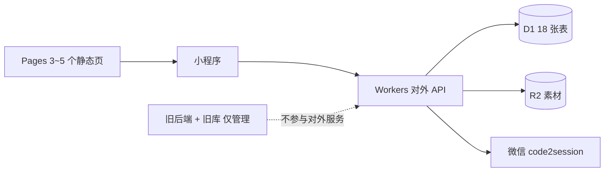

# CF后端迁移 2.0.0：对外 API 迁移计划

项目代号：CF后端迁移（计划首版 2.0.0）　目标架构：Cloudflare Workers + Pages + D1 + R2

> 运行中的版本号不在这份计划里维护：唯一来源是 `main.js` 的 `API_VERSION`（当前 `2.1.0`）。
迁移来源：`fastapi/`（对外 API 部分）　本文档位置：`app/api-cf/Plan.md`

**一句话结论**：对外接口共 **33 条**、业务表 **18 张**、数据合计 **196 行**、素材实测 **0.57 MB** —— 体量上是一次"小搬家"；真正的难点只有三处：**缩略图不能在 Workers 里生成**、**进程内限流/缓存失去意义**、**管理后台留在旧库会造成运营断链**。



---

## 1. 迁移范围

### 1.1 纳入：33 条对外接口

逐条台账（含行号依据与关键字段）见 `notes/api-inventory.md`，此处为清单：

**用户（`app/api/user.py`，9 条）**

| 方法 | 路径 | 需登录 |
| --- | --- | --- |
| POST | `/user/login` | 否 |
| POST | `/user/get_user_info` | 是 |
| POST | `/user/update_profile` | 是 |
| POST | `/user/upload_avatar` | 是（multipart，字段名 `avatar`） |
| POST | `/user/delete_account` | 是 |
| POST | `/user/deleted_account_action` | 否（凭 `code`） |
| POST | `/user/user_favorites` | 是 |
| POST | `/user/user_likes` | 是 |
| POST | `/user/user_view_history` | 是 |

**笔记（`app/api/news.py`，9 条）**

| 方法 | 路径 | 需登录 |
| --- | --- | --- |
| GET | `/news/list` | 否 |
| GET | `/news/detail` | 否 |
| POST | `/news/like` | 是 |
| POST | `/news/favorite` | 是 |
| POST | `/news/share` | 否（可游客） |
| POST | `/news/add_comment` | 是 |
| GET | `/news/get_comments` | 否 |
| GET/POST | `/news/check_user_action` | 否（须给 `user_id`） |
| POST | `/news/check_user_like_batch` | 是 |

**内容下发（`app/api/content.py`，6 条）**

| 方法 | 路径 | 需登录 |
| --- | --- | --- |
| GET/POST | `/content/get_banners` | 否 |
| GET/POST | `/content/get_outdoor` | 否 |
| GET/POST | `/content/get_motorcycle` | 否 |
| GET/POST | `/content/get_notices` | 否（token 可选） |
| GET/POST | `/content/get_notice_unread` | 是 |
| POST | `/content/notice_read` | 是 |

**配置与状态（`app/api/app_config.py` 1 条 + `app/api/service_status.py` 5 条 + `app/core/` 3 条）**

| 方法 | 路径 | 需登录 |
| --- | --- | --- |
| GET/POST | `/config/get_app_config` | 否 |
| GET | `/` | 否（HTML 状态页；`?format=json` 返回 JSON） |
| GET/POST | `/test`、`/index`、`/info` | 否（301 重定向） |
| GET/POST | `/apitest` | 否（`ENABLE_PUBLIC_PROBE` 可关） |
| GET | `/health`、`/health/ready` | 否 |
| GET | `/metrics` | 否（仅 `OBSERVABILITY_ENABLED` 时挂载） |

另：`GET /favicon.ico`、4 个静态挂载（`/avatar_uploads`、`/news_uploads`、`/images`、`/admin/static`）中**前三个需要等价物，`/admin/static` 不迁移**。

### 1.2 管理功能（2026-10-04 起改为分阶段迁移，不再整体排除）

> 下面的清单是 2.0.0 首版的取舍；其后用户要求把后台也一并搬过来，于是改为**分阶段实施**，
> 现**已全量迁移完成（19 个页面）**：控制面板、用户、用户笔记审核、管理员、笔记（含回收站与批量）、留言、
> 分类、轮播图、通知公告、首页板块、首页精选、专题精选、版本配置、运营文案、我的页菜单、管理员设置、系统信息，
> **以及数据库工具 / 数据库管理（`ENABLE_SQL_TOOL` 默认关）与素材库治理**（原"不迁移"的两页后改为一并迁）。
> 账号沿用旧站做法（D1 的 `admin_users` 表 + 签名 Cookie 会话，口令哈希因免费套餐 CPU 限制改用 PBKDF2）。
> 目录结构、鉴权取舍、与旧站的逐项差异见 **`app/api-cf/admin/README.md`**；
> 与 `fastapi/` 的逐文件/逐机制对应关系见 **`app/api-cf/notes/structure-map.md`**。

首版排除范围（保留备查）：

- `app/admin/` 全部路由：登录、仪表盘、用户与管理员、笔记与回收站、轮播图、分类、首页板块、精选、专题、公告、留言、配置中心、设置、工具、数据库管理、素材库管理
- 58 个 Jinja2 模板、`/admin/static` 静态资源
- `admin_users` 表与"仅超级管理员可用"的权限口径
- 管理端素材上传与审计落盘

### 1.3 对外接口与管理功能的耦合拆分

| 耦合点 | 现状 | 拆分方式 |
| --- | --- | --- |
| `is_trusted` | 资料下发（`user.py:84,302,444,464`）；留言免审（`news.py:615-618`）；专题视频可见性（`content.py:150-170`） | 字段与语义原样保留，取值来自 `users.is_trusted`；**该字段的写入口（后台）不在本次范围**，切换后只能靠改库 |
| `is_admin` | 作者标识与列表可见性（`news.py:258-259,394-396`） | 仅语义，不查 `admin_users` 表；D1 里不建该表 |
| `trusted_only` | 菜单项下发（`app_config.py:306-308,401`） | 原样透传 |
| 静态挂载与缓存头 | `main.py:1100-1168` 统一加 `Cache-Control` | 搬到 R2 自定义域/前置 Worker（见 §3） |
| 审计与日志 | 管理端审计落盘（`core/logging.py:144-252`） | 对外 API 不产生审计，仅保留访问日志 |

---

## 2. 数据库

### 2.1 现状（实测，2026-10-04 于 `fastapi/data/lyjx.db`，360 KB）

| 表 | 行数 | 用途 |
| --- | --- | --- |
| `users` | 4 | 小程序用户（含 `token`、`is_trusted`、`status`） |
| `news` | 69 | 笔记主表（8 个索引，含 `(status,type,publish_time,id)` 覆盖索引） |
| `news_likes` / `news_favorites` / `news_shares` / `news_view_history` | 6 / 6 / 0 / 13 | 行为表，均 `UNIQUE(news_id,user_id)` |
| `news_comments` | 4 | 留言（审核状态） |
| `banner_images` | 18 | 轮播图 |
| `motorcycle_trips` / `outdoor_activities` | 10 / 8 | 专题 |
| `app_categories` | 10 | 分类 |
| `app_home_sections` | 10 | 首页板块 |
| `app_featured_items` | 3 | 精选入口 |
| `app_menu_items` | 11 | 「我的」页菜单 |
| `app_texts` | 7 | 文案 |
| `app_notices` / `app_notice_reads` | 8 / 8 | 公告与已读 |
| `app_version_config` | 1 | 版本更新配置（单行 id=1） |
| 合计 | **196** | 18 张表 |

不迁移的三张表：`admin_users`（管理后台）、`schema_migrations`（旧库自愈台账）、`app_api_routes`（**代码中已无任何引用**，疑似遗留，待确认可否废弃）。

索引共 **45 条**，全部保留（AUTOINCREMENT 主键写法保持）。

> **建表脚本以旧库的真实 DDL 为准，不以静态 SQL 文件为准**：旧后端启动自愈会在运行时补列、补索引，实测静态 `fastapi/app/sql/schema_sqlite.sql` 比线上库**少 1 列**（`app_home_sections.page_path`）与 **7 条索引**。因此 `app/sql/0001_schema.sql` 由旧库 `sqlite_master` 直出，含 18 张表、45 条索引。
> **已实测往返**：建表 → `export_sqlite.py` 导出 196 行 → 导入本地 SQLite，**18 张表行数 0 差异**（2026-10-04），脚本与建表语句均已通过真实解析。
> 注意：`news.type` 的默认值是 `'admin_users'`，属业务取值，建表脚本原样保留。

### 2.2 D1 兼容性（逐项）

| 项目 | 现状 | D1 处理 |
| --- | --- | --- |
| 触发器 / 视图 / FTS5 / JSON1 / `RETURNING` / `ON CONFLICT` | **源脚本实测无** | 无需处理；将来若要全文检索，D1 无 FTS5 → 用 `LIKE` 或外部索引（待确认） |
| `AUTOINCREMENT` | 每张表主键 | D1 支持，原样保留 |
| `datetime('now','localtime')` 默认值 | 18 处 | **已改为 `datetime('now','+8 hours')`**，不依赖时区表，且与业务固定东八区一致 |
| `PRAGMA`（`foreign_keys`/`journal_mode=WAL`/`busy_timeout`/`synchronous`） | `database.py:96-112` | **不迁移**：D1 连接行为由平台管理，业务代码不应发 PRAGMA |
| 占位符 | 全仓 `?`（`database.py:6-7`）；MySQL 侧自动换 `%s` | 与 D1 一致，无需改写 |
| 事务 | `database.py:294-322` 显式 `BEGIN`；调用点 6 处（点赞/收藏、分享、公告已读、浏览历史 upsert 等） | 改为 `env.DB.batch([...])`：原子、单次往返；**不要**在业务里发 `BEGIN` |
| 批量写 | `executemany` 只在工具里用；应用层是 `IN (...)` 单条 | `batch()` 拆多条，热点计数用 `UPDATE ... SET likes = likes + 1`（原子自增，避免读改写竞态） |
| 连接池 / 线程池 | `core/db_pool.py`（SQLite 池下限 48） | **不存在**：每次请求拿绑定，连接复用由平台处理 |
| 并发与一致性 | 单进程 WAL | D1 是**单写者**：写串行、写冲突会报错 → 写路径短事务 + 失败重试；读路径不要依赖"刚写完立刻读到"的强一致（会话一致性方案待确认） |
| 时区与排序 | `timeutil.local_now()` 固定 +08:00；`publish_time` 原样透传（库内字符串） | 保持字符串口径不动，排序 `ORDER BY publish_time DESC, id DESC` 不变 |
| 双驱动残留 | `DB_DRIVER` + MySQL 分支 + `.env` 里 `DB1_*` 等 | 新项目**只保留 SQLite 一种**，MySQL 相关代码与配置不进新站 |

### 2.3 数据搬迁（由你执行）

```bash
# 1) 建表（18 张，已剔除管理表与台账）
wrangler d1 execute <DB_NAME> --file=app/api-cf/app/sql/0001_schema.sql --remote

# 2) 导出旧库为 INSERT 脚本
python app/api-cf/tools/export_sqlite.py fastapi/data/lyjx.db app/api-cf/out/seed.sql

# 3) 导入
wrangler d1 execute <DB_NAME> --file=app/api-cf/out/seed.sql --remote

# 4) 校验：逐表行数必须 0 差异（配了 CLOUDFLARE_ACCOUNT_ID / D1_DATABASE_ID / CLOUDFLARE_API_TOKEN 会直接对比 D1）
python app/api-cf/tools/verify_counts.py fastapi/data/lyjx.db
```

- **回滚**：D1 侧 `DROP TABLE` 后重建、重跑导入（数据量小，重跑成本近乎为零）；旧库全程只读不动。
- **时点**：正式切换前重跑一次导出，避免旧库有新数据。

---

## 3. 素材

### 3.1 现状

- 挂载：`/avatar_uploads`、`/news_uploads`、`/images`（`main.py:1580-1593` StaticFiles 公开直读）。
- 缓存头分档（`main.py:1127-1148`）：vendor 1 年 immutable、`/admin/static` 7 天、`/_thumb/` 1 年 immutable、其余媒体取 `media_cache_max_age`（默认 7 天）。
- 库内只存**相对路径**（`main.py:1576`），响应时拼成绝对 URL（`asset_url`，`helpers.py:689-700`）；小程序侧用 `LEGACY_MEDIA_HOSTS` 做域名归一化。
- 缩略图：`news_uploads/_thumb/<宽度>/<文件名>.webp`，宽度 **480**（`helpers.py:747`）与 **800**（`render.py:199`），由 Pillow 生成（`storage.py:375-478`，WEBP q80）；生成时机是"管理端上传时预生成"（`admin/news_media.py:66`）+ CLI 补跑（`tools/make_cover_thumbs.py`）；列表接口只查不生成（`storage.py:327`）。
- 实测体量：`news_uploads/` **23 个文件 0.57 MB**（全在 `home/`），`avatar_uploads/` **空**，`app/images/` 4 个文件 0.1 MB。**仓库内没有任何视频文件**。
- **不存在 ffmpeg 调用**（全仓核实）：视频压缩不在后端，代码里明确跳过图片重编码。

> ⚠️ 更正：早期资料曾写"素材约 28 GB"，实测为 **0.57 MB**。**本次只搬这些现有文件，不涉及视频**（已定）。

### 3.2 与 R2 的对应关系

| 现状 | R2 方案 |
| --- | --- |
| `/news_uploads/...`、`/avatar_uploads/...` 静态挂载 | R2 bucket + 公开自定义域；**key 与库内相对路径一致**（`news_uploads/home/x.jpg`），数据库字段不改 |
| `/images`（app/images，4 个文件） | 与 Pages 静态页同置，或并入 R2 公开前缀 |
| 缓存头分档 | 自定义域缓存规则或前置 Worker 设置：媒体 7 天、`_thumb/` 1 年 immutable；**R2 对象不自动带 `Cache-Control`**，必须在写入或响应时设置 |
| 缩略图派生文件 | 迁移期用现成工具预生成后随原图一起上传（Workers 无 Pillow，**不能在线生成**）；接口行为保持"查得到就用、查不到回退原图" |
| 公开/私有（**已定**） | 公开前缀：`news_uploads/`、`avatar_uploads/`、`images/`，挂 R2 自定义域**边缘直读**（不经 Worker，最快）；**本次不涉及视频**，不需要私有前缀与签名 URL |
| 上传接口（**已定**） | **Worker 中转写 R2**：保留 `/user/upload_avatar` 的 multipart 契约与 `data.avatar_url` 返回字段，**小程序零改动**；预签名直传**本次不做**（需把小程序改成两段式上传，且体积约束依赖 S3 POST policy，R2 是否支持 **待确认**）——列为"将来单图变大时的升级路径"，届时另加接口、不动现有契约 |

---

## 4. 无法直接迁移的能力与替代方案

| 能力 | 现状位置 | 替代方案 |
| --- | --- | --- |
| Pillow 图片压缩/缩略图 | `storage.py:375-478`、`tools/shrink_media.py` | 迁移期用现成 CLI 预生成；新上传的缩略图由**客户端压缩**（小程序原生能力）或按需延迟到下次批量任务 |
| `tools/` 6 个脚本 | `sync.py`、`mysql_to_sqlite.py`（MySQL 相关，**直接废弃**）、`shrink_media.py`、`make_cover_thumbs.py`、`check_nicknames.py`、`reset_admin_password.py` | 均为离线 CLI、运行时不导入 → 不需要迁移，在旧环境执行即可 |
| Termux 每小时定时重启 | 仅文档描述（代码无实现） | 不需要：Worker 无常驻进程；若仍需定时任务（清理过期数据等）用 **Cron Triggers** |
| 启动自愈（建表/补列/补索引/种子） | `core/schema_init.py:957,1071` | 一次性 SQL（`app/sql/0001_schema.sql`）+ 数据导入脚本；**不再需要运行时自愈** |
| 启动预热（数字快照/模板预编译/系统信息快照） | `main.py:379,404-472` | 模板预热不存在（无模板）；数字快照改为按需查询；如需缓存用 Cache API |
| 进程内缓存（60s/30s/5s 分档） | `core/cache.py`（TTLCache）、`core/distcache.py` | Workers 多 isolate、无进程内状态 → **先不加缓存**（数据量极小），确有热点再上 Cache API |
| 进程内限流（写操作 60/30/20/120 每分钟、头像 5/60、登录锁定） | `core/ratelimit.py:37,114,160` | **已定：D1 计数表**（`app/sql/0002_rate_limit.sql` 的 `rate_limit_counters`，设计见 `notes/limits-design.md`）—— 因为**只能用免费套餐，Durable Objects 不可用**；计数与业务写入放进同一次 `batch()`，不额外增加往返，口径与旧站一致、超额返回 429「操作过于频繁，请稍后再试」。**成本核算**：每条受限写操作多 **1 行读 + 1 行写**，而 D1 免费额度为 **读 5,000,000 行/日、写 100,000 行/日**（当前实际用量 6.4k 读 / 1.4k 写）—— 余量充足 |
| 微信 `access_token` 缓存（7200s，提前 300s 过期） | `core/wechat.py:98-99` | KV 缓存（**待确认**）或每次必取（有触发微信频率限制的风险） |
| 审计落盘 + 滚动日志 | `core/logging.py:144-252` | 管理端不在范围；访问日志改用 Workers Logs / Logpush（**待确认**） |
| gzip 压缩中间件 | `main.py:1278-1380` | 由 Cloudflare 边缘对文本自动压缩，无需实现 |
| CORS / 安全头 / 请求体限制中间件 | `main.py:554-560,917-947`、`middleware.py:94-146` | 保留为 Worker 里的几十行中间件；或用边缘 Transform Rules（**待确认**） |
| `/` 状态页 HTML | `service_status.py:161` | Pages 静态页（保留 `?format=json` 的 JSON 响应） |
| `/metrics` Prometheus | `core/metrics.py:133` | 用 Workers Analytics 替代；小程序不消费则可停（**待确认**） |

---

## 5. 分步迁移方案

| 步骤 | 目标 | 改动范围 | 验证方式 | 风险与回滚 |
| --- | --- | --- | --- | --- |
| **P0 立项与账号** | 账号、域名切分、资源就位 | 无需改代码：创建 D1（⚠️ 账号内库数量已用 **9/10**，先定"复用已有库"还是"腾名额"，见 §7 第 4 项）、R2 bucket、Pages 项目；域名已定 `api.` / `media.` / `pages.250036.xyz`；准备 `wrangler` 登录与 Secret | `wrangler whoami`、`wrangler d1 list`、R2 对象读写与公开域 200 | 不触碰旧站，**无风险** |
| **P1 骨架** | 新站可运行、状态类接口可用 | 新建 `app/api-cf/`：入口分发、统一响应与错误、时区工具、静态资源；实现 `/`、`/test`、`/index`、`/info`、`/apitest`、`/health`、`/health/ready`、`/favicon.ico`、CORS/安全头；**接入 D1 计数表限流**（`app/sql/0002_rate_limit.sql` + `notes/limits-design.md`） | 逐条与旧站对比响应体与状态码（含 301 与 `?format=json`）；限流超额实测 429 且文案逐字一致 | 新站未接流量；回滚=删除部署 |
| **P2 数据与素材** | D1 与 R2 就位 | 执行 §2.3 四步；R2 上传按 `tools/media_to_r2.md`（含预生成缩略图） | `verify_counts.py` 逐表 0 差异；抽 5 个素材 key 直读 200；缩略图缺失回退原图实测 | 风险：导出时旧库有新写入 → 切换前重跑导出；回滚：drop 重建重跑 |
| **P3 读路径** | 只读接口先跑通 | `/news/list`、`/news/detail`、`/news/get_comments`、`/news/check_user_action`、6 条 content、`/config/get_app_config` | 写一个 diff 脚本：同一参数分别打旧站与新站，逐字段比对 JSON（含 `code=0`、`message` 键、分页 `has_more` 口径） | 风险：响应体不一致会直接让小程序出错 → 必须逐字段对齐；回滚：未切线路，无影响 |
| **P4 写路径** | 行为写入可用 | `/news/like`、`/news/favorite`、`/news/share`、`/news/add_comment`、`/news/check_user_like_batch`、`/user/user_view_history` 的写分支；每个写接口接上 D1 计数表限流 | 真实小程序在测试域名操作；计数用 `UPDATE 自增` 后与预期一致；并发点赞同一笔记不产生重复行；**压到配额上限时返回 429 且文案逐字一致**（点赞 60 / 收藏 60 / 分享 30 / 留言 20 每分钟） | 风险：D1 单写冲突 → 短事务 + 重试；重复写 = 依赖唯一索引兜底；回滚：切回旧线路 |
| **P5 用户与鉴权** | 登录链路闭环 | `/user/login`（微信 `code2session`）、`/user/get_user_info`、`/user/update_profile`、`/user/upload_avatar`（→R2）、`/user/delete_account`、`/user/deleted_account_action`、收藏/点赞/历史列表 | 真机登录 → 改昵称 → 传头像 → 收藏/点赞 → 注销 → 恢复，全链路走一遍；token 与旧站生成规则一致（`token_urlsafe(32)`） | 风险：微信 `access_token`/`code2session` 需要**真实 AppSecret 与出网权限**（待确认）；登录串号风险 → 上线前用测试账号验证；回滚：切回旧线路 |
| **P6 切换与收尾** | 小程序切到新站 | 改小程序线路常量（`utils/constants.js` 的 `DEFAULT_API_BASE`/`API_LINES`），先只对内部测试用户灰度，再全量；旧站对外停服 | 灰度观察 3~7 天：错误率、接口耗时、小程序端报错；`verify_counts.py` 每日一次 | 回滚：小程序切回线路一（旧后端与旧库始终未被修改，**秒级回滚**） |

---

## 6. 关键风险

1. **运营断链（最大业务风险）**：管理后台留在旧后端与旧库，切换后运营在后台的任何改动**不会进入 D1**。**已定：由你手工在 D1 执行 SQL**，常用改法与校验见 `notes/ops-sql.md`；代价是运营改动没有界面，且切换后应停止使用旧后台（否则改了旧库却不生效）。
2. **请求体与执行限制（免费套餐口径，2026-10-04 控制台实测）**：Workers 免费额度为 **请求 100,000/日、可观测性事件 200,000/日、构建 3,000 分钟/月**；D1 免费额度为 **读 5,000,000 行/日、写 100,000 行/日、存储 5 GB、库数量上限 10 个**。**CPU 时间的具体毫秒数仍需以官方文档为准（待确认）**。对应处置：头像上传照旧做类型白名单与大小上限（`user.py:645-661`）；留言正文净化是重正则，须在 P4 压测确认不触发 CPU 上限（留言限 500 字，实测风险低）；观测用 Workers Logs / `wrangler tail`（免费额度内）；将来单图变大或需要强限流时再考虑升级付费（届时可换 Durable Objects 与 Logpush）。
3. **冷启动**：首请求延迟高于常驻进程；`/health*` 与列表接口的 P95 需在验收时实测。
4. **D1 写入与一致性**：单写者、写串行；避免"写后立刻强一致读"的依赖；批量写用 `batch()`；热点计数用原子自增。
5. **R2 读写与权限**：读走公开自定义域（`news_uploads/`、`avatar_uploads/`、`images/`），写走 Worker 中转 —— **不需要把 S3 凭据下发给任何客户端**，少一个泄露面；R2 对象不自带 `Cache-Control`，必须在写入或响应时设置，否则小程序端可能吃到与旧站不一致的缓存。
6. **鉴权**：对外接口是"token 明文入库 + 每请求查库"（`helpers.py:582,598`），迁移后行为保持一致；注意 401/403 文案与旧站逐字一致（小程序可能按文案提示）。会话 cookie 那套（后台）不涉及。
7. **小程序端影响**：
   - 必须改的只有**线路地址常量**（`DEFAULT_API_BASE`、`API_LINES`）；回滚即切回线路一。
   - **响应字段不能改**：`{code,msg,data}`、`code=0` 的特例、`message` 键、分页字段名与 `has_more` 口径必须逐字一致，否则要改小程序。
   - 媒体域名：新站换了域名后，`LEGACY_MEDIA_HOSTS` 需补上新域名，避免旧图地址不被归一化。
   - 静态资源改版记得换 `?v=` 缓存键。
8. **时间口径**：全站固定 +08:00，`publish_time` 原样透传（库内字符串）；迁移时不要"顺手格式化"。
9. **无 Pillow**：缩略图只能在迁移期预生成；新上传的图若客户端不压缩，就没有缩略图（接口会回退原图，功能不坏但流量变大）。

---

## 7. 需要你确认的事项

1. **域名与 DNS（已定）**：API 用 `api.250036.xyz`、媒体用 `media.250036.xyz`、静态页用 `pages.250036.xyz`；**旧 `api0.250036.xyz` 原样保留**作回滚入口。
2. **账号与计费（已定：免费套餐）**：Workers / D1 / R2 / Pages 全部使用免费额度；**超出免费额度会不可用或产生费用**，且免费版**不含 Durable Objects 与 Logpush** —— 限流方案已因此改为 D1 计数表（见 §4）。
3. **R2 权限模型（已定，待你确认域名）**：公开前缀 `news_uploads/`、`avatar_uploads/`、`images/` 走自定义域直读；上传走 Worker 中转；仅当线上确实有视频时才需要私有前缀 + 签名 URL。
4. **D1 与 Workers 额度（已实测，2026-10-04 控制台）**：D1 免费为 **读 5,000,000 行/日、写 100,000 行/日、存储 5 GB、最多 10 个数据库**；Workers 免费为 **请求 100,000/日、可观测性事件 200,000/日、构建 3,000 分钟/月**。限流计数会让每条受限写操作**多 1 行读 + 1 行写**（与业务写入同批，不额外往返），按当前用量（6.4k 读 / 1.4k 写）余量充足。
   - ⚠️ **数据库数量已用 9 / 10**：新建本项目 D1 前，需要你决定是"复用已有库"还是"腾出名额"（既有库的取舍请你自己定，我不会替你删）。
5. **Pages**：3~5 个静态页（用户协议、隐私政策、下载/状态页）由 Pages 托管还是并入 Worker 静态响应？域名用哪个？
6. **是否保留旧后端并行运行**：切换后旧站是否停服？如果停，运营后台怎么办（见下条）。
7. **运营改数据的通道（已定）**：**手工在 D1 执行 SQL**，文案/菜单/轮播/公告/精选/分类/版本各有现成语句，见 `notes/ops-sql.md`；代价是无后台界面，且切换后应停用旧后台（避免改了旧库不生效）。
8. **微信凭据与出网（已定）**：`WECHAT_APPID`/`WECHAT_SECRET` 可用，用 `wrangler secret put` 存入 Worker（不进仓库、不下发客户端）；联调可开 `DEV_WECHAT_MOCK`。
9. **限流与缓存（已定）**：限流用 **D1 计数表**（免费套餐下 Durable Objects 不可用，见 `notes/limits-design.md`）；缓存仍是"先不加"，热点出现再上 Cache API；微信 `access_token` 是否用 KV 缓存 **待确认**。
10. **观测（已定）**：免费额度含**可观测性事件 200,000/日**，Workers Logs / `wrangler tail` 够用（今日已用 949）；Logpush 属付费功能，本次不用；`/metrics` 若仍有消费者再定（**待确认**）。
11. **遗留表**：`app_api_routes`（4 行，代码无引用）是否可以废弃？
12. **素材（已定）**：只搬仓库内现有 `news_uploads/`（23 个文件 0.57 MB）与 `app/images/`（4 个文件）；不涉及视频，无需私有块与签名 URL。

---

## 8. 验收清单（切换前的硬门槛）

- [ ] 33 条接口逐条 `curl` 比对：状态码、响应体字段与取值、`code`/`message` 特例、分页字段完全一致
- [ ] 301 重定向（`/test`、`/index`、`/info`）与 `?format=json` 行为一致
- [ ] `verify_counts.py` 逐表 0 差异；关键聚合（笔记数、点赞数、收藏数）抽样一致
- [ ] 随机 5 个素材 key 直读 200；缩略图存在时用缩略图、缺失时回退原图
- [ ] 真机全链路：登录 → 列表 → 详情 → 点赞/收藏 → 留言 → 浏览历史 → 改昵称 → 上传头像 → 注销 → 恢复
- [ ] 并发冒烟：同一用户并发点赞/收藏不产生重复行、计数正确
- [ ] 限流生效：D1 计数表口径下超额返回 429，文案与旧站逐字一致（含登录锁定）
- [ ] 回滚演练：小程序切回线路一，5 分钟内恢复
- [ ] 只对内部测试用户灰度一轮，无异常后再全量

---

## 9. 目录结构与脚本用法

```
app/api-cf/
├── Plan.md                 # 本文档
├── README.md               # 本地跑法/自测/对拍/已知差异
├── DEPLOY.md               # 部署文档(两条路线: 网页端 Git 连接 / wrangler 命令行)
├── wrangler.toml           # 配置: Worker/Pages 名 lyjxxapp-api、D1 绑定 lyjxxapp-d1、R2 绑定 lyjxxapp-r2、vars 全预置
├── package.json            # 仅开发脚本(dev/test/schema:local), 无运行时依赖
├── src/                    # 33 条接口实现: index.js + lib/(10 个基础设施模块) + routes/(7 个路由模块)
├── tests/                  # node --test 自检(28 条), 函数桩模拟 D1/R2, 不联网
├── app/sql/0001_schema.sql  # D1 建表脚本(18 张表, 已剔管理表/台账, 时区改 +8)
├── app/sql/0002_rate_limit.sql  # 新站新增: 限流计数表(D1 计数表方案, 免费套餐可用)
├── tools/
│   ├── export_sqlite.py    # 旧库 → D1 可执行 INSERT 脚本(你自行执行)
│   ├── verify_counts.py    # 旧库与 D1 逐表行数对比(0 差异才可切线路)
│   └── media_to_r2.md      # 素材上 R2 的步骤与核对方法
└── notes/
    ├── api-inventory.md    # 33 条接口台账(含行号依据), Plan.md 的取值来源
    ├── ops-sql.md          # 运营改文案/菜单/轮播/公告/精选的手工 SQL 速查
    └── limits-design.md    # D1 计数表限流与登录锁定设计(免费套餐口径)
```

```bash
python app/api-cf/tools/export_sqlite.py fastapi/data/lyjx.db app/api-cf/out/seed.sql
python app/api-cf/tools/verify_counts.py fastapi/data/lyjx.db
wrangler d1 execute <DB_NAME> --file=app/api-cf/app/sql/0001_schema.sql --remote
wrangler d1 execute <DB_NAME> --file=app/api-cf/out/seed.sql --remote
```

> 脚本只依赖 Python 标准库，不需要安装任何包；导入 196 行数据用 `wrangler d1 execute --file` 足够，不必写复杂导入器。
> `app/api-cf/out/` 是生成物目录（导出脚本的产物），不需要提交，切换前重跑一次导出即可。
